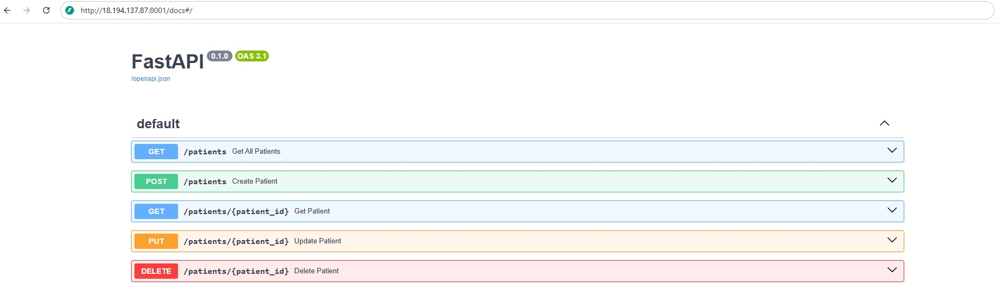

# GlucoMed
Distributed systems project for healthcare - Glucomed

The goal of this project is development of a backend system in healthcare that monitors the level of glucose in patients using data from IoT devices, based on a microservices architecture.
Microservices will be implemented for managing reading data, patient management and device management.
The system will be based on a distributed architecture, using Python and FastAPI for API deveploment, DynamoDB as the database, Docker for containerization, and Nginx as a load balancer to ensure high availability and system reliability. The system will be deployed on AWS EC2.

## Patients API
http://18.194.137.87:8001/docs#/

